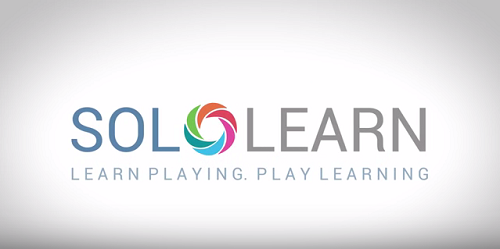

<h1 align="center">Sololearn Api</h1>
<p align="center">
            Learn Playing Play Learning 
</p>


[![Contributors][contributors-shield]][contributors-url]
[![Forks][forks-shield]][forks-url]
[![Stargazers][stars-shield]][stars-url]
[![Issues][issues-shield]][issues-url]
[![MIT License][license-shield]][license-url]




## Usage

Endpoints:

```sh
https://soloapi.herokuapp.com/sololearn  
```
```sh
https://soloapi.herokuapp.com/playground/:section/:language  
```

Query:

```sh
https://soloapi.herokuapp.com/sololearn?sololearn_id= your_sololean_id
```

# Usage example

  ## For User Basic Info.
  ```sh
  GET https://soloapi.herokuapp.com/sololearn?sololearn_id=13710268
  ```
  >You Will Get Responce As Shown In Screenshot.
  
  ## For Coding Playground Info.
  ```sh
  GET https://soloapi.herokuapp.com/playground/trending/all
  ```
  > In This Example You Need To Pass Two Params First :section eg.Trending,MostRecent,MostPopular etc
  And Second Parameter is :language to get specific language list of objects eg.web,py,java,c etc.
 
  * section parameters
    * Trending
    * MostRecent
    * MostPopular
    
  * language parameters
    * web
    * c
    * cs
    * cpp
    * java
    * kt
    * py
    * php
    * swift
    * all
  

## Release History

* v1
    * CHANGE: Formatted Code.


Distributed under the MIT license. See ``LICENSE`` for more information.

[https://github.com/PrasadBroo/Sololearn-Api/](https://github.com/PrasadBroo/)

## Contributing

1. Fork it (<https://github.com/PrasadBroo/Sololearn-Api/fork>)
2. Commit your changes (`git commit -am 'some changes made'`)
4. Push to the branch (`git push origin master`)
5. Create a new Pull Request

<!-- Markdown link & img dfn's -->
[travis-image]: https://img.shields.io/travis/dbader/node-datadog-metrics/master.svg?style=flat-square
[travis-url]: https://travis-ci.org/dbader/node-datadog-metrics
[wiki]: https://github.com/PrasadBroo/Sololearn-Api/
[contributors-shield]: https://img.shields.io/github/contributors/PrasadBroo/Sololearn-Api.svg?style=flat-square
[contributors-url]: https://github.com/PrasadBroo/Sololearn-Api/graphs/contributors
[forks-shield]: https://img.shields.io/github/forks/PrasadBroo/Sololearn-Api.svg?style=flat-square
[forks-url]: https://github.com/PrasadBroo/Sololearn-Api/network/members
[stars-shield]: https://img.shields.io/github/stars/PrasadBroo/Sololearn-Api.svg?style=flat-square
[stars-url]: https://github.com/PrasadBroo/Sololearn-Api/stargazers
[issues-shield]: https://img.shields.io/github/issues/PrasadBroo/Sololearn-Api.svg?style=flat-square
[issues-url]: https://github.com/PrasadBroo/Sololearn-Api/issues
[license-shield]: https://img.shields.io/github/license/PrasadBroo/Sololearn-Api.svg?style=flat-square
[license-url]: https://github.com/PrasadBroo/Sololearn-Api/blob/master/LICENSE.txt

