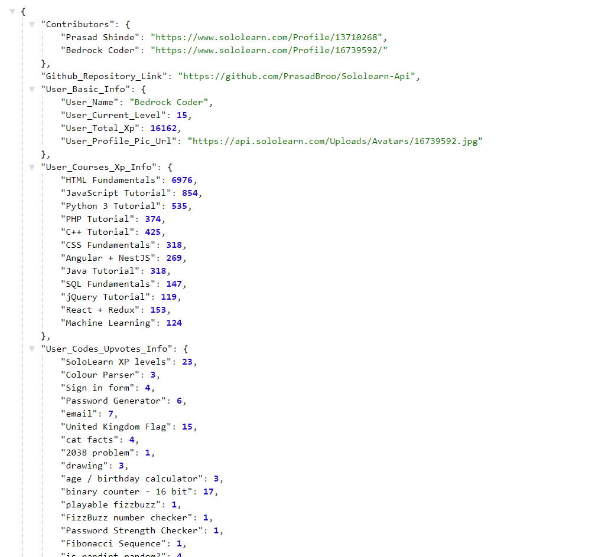

# Sololearn Api
> Get Any User Information.




## Usage

Endpoints:

```sh
https://sololearn-api-by-prasad.herokuapp.com/sololearn
```

Query:

```sh
https://sololearn-api-by-prasad.herokuapp.com/sololearn?sololearn_id=16739592  change id to yours.
```

## Usage example

Make request to endpoint with sololearn_id (query) and get details of that user as showed in screenshot


## Release History

* v1
    * CHANGE: Added Contributors.


## Follow Us On Sololearn (Contributors)

Prasad Shinde – [Prasad Shinde](https://www.sololearn.com/Profile/13710268) 
Bedrock Coder – [Bedrock Coder](https://www.sololearn.com/Profile/16739592/) 

Distributed under the MIT license. See ``LICENSE`` for more information.

[https://github.com/yourname/github-link](https://github.com/dbader/)

## Contributing

1. Fork it (<https://github.com/PrasadBroo/Sololearn-Api/fork>)
2. Commit your changes (`git commit -am 'some changes made'`)
4. Push to the branch (`git push origin master`)
5. Create a new Pull Request

<!-- Markdown link & img dfn's -->
[travis-image]: https://img.shields.io/travis/dbader/node-datadog-metrics/master.svg?style=flat-square
[travis-url]: https://travis-ci.org/dbader/node-datadog-metrics
[wiki]: https://github.com/yourname/yourproject/wiki

